# Huawei-Atlas200DK-Car

## 1 项目背景

本项目同济大学软件学院2020年嵌入式系统设计的课程设计项目，即基于华为Atlas200DK开发板的智能小车项目。小组在最初的项目代码基础上进行了修改完善，并自主开发了智能小车远程控制程序。最终实现的完整效果与功能：

- 在远程控制程序上实时显示搭载在小车上的摄像头拍摄到图像
- 远程切换小车的模式：停止、防跌落、车道检测、自动跟随、远程控制，并提供了小车在远程控制模式下的遥控界面。
- 对智能小车的防跌落功能进行测试。

项目成员：

| 李嘉睿 |
| ------ |
| 陈哲   |
| 董震宇 |
| 胡钰弦 |

## 2 开发过程

### 2.1 小车初始源码

小组对目标机上的小车代码进行了研读，把握各个子系统的功能。程序简略运行流程图如下：

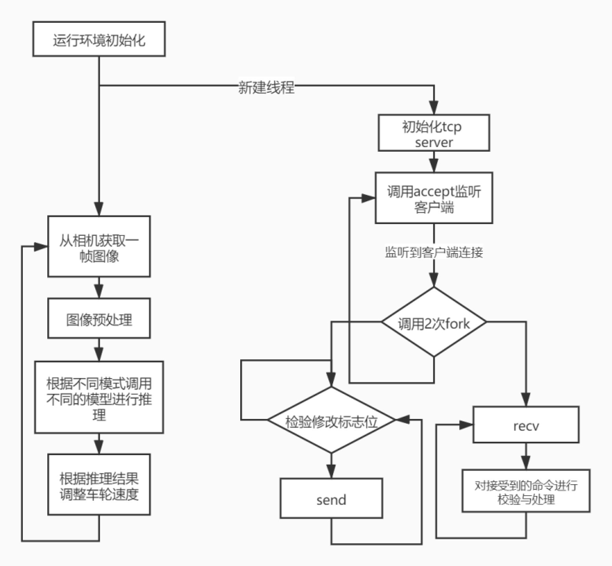

1. 运行环境初始化：运行时资源分配，模型推理资源分配，iic端口测试（车轮控制），摄像头初始化，共享内存区域创建。
2. 在新开线程中进行socket tcp server创建。在检测到有客户端连接后，调用2次fork()函数，创建2个子进程分别用于接收远程控制命令与实时发送摄像头图像。
   1. 对子进程Ⅰ（发送图像），通过轮询方式检测共享内存区的图像修改标志位是否为true。若为true，则通过socket向客户端用send()函数发送一帧图像
   2. 对子进程Ⅱ（接收命令），循环调用recv()函数，成功接收到来自客户端的命令后，对其进行校验与解析执行。
3. 父进程在初始化完成后，进入主循环：
   1. 从相机取出一帧图像
   2. 对图像进行预处理：将图片大小resize成模型的输入尺寸
   3. 根据小车当前模式的不同，将预处理后的图片输入到对应的模型当中并获取模型输出
   4. 根据小车当前模式的不同，用不同的方式处理模型的输出并改变车轮速度（iic输出电压大小与正负）

### 2.2 修改与完善

可以注意到初始代码并没有修改共享内存图像标志位与将图像拷贝到共享内存区的代码，故小组对这部分进行了修改完善。最初组内提出3种方案使图像传输子系统获取到摄像机的图像：

1. 将保存图像的变量设为全局变量
2. 将保存摄像头句柄的对象设为全局变量
3. 使用共享存储区

方法一由于图像传输子系统已经是一个子进程，故在父进程修改的全局变量不能反映在子进程当中。

方法二虽然可行，但是由于要花费不菲的时间来重新获取图像与图像预处理（减少分辨率以降低传输速率要求），且会出现设备冲突的情况，故舍弃。

最终采取方案三的方法，在父进程的主循环中、图像预处理后，插入修改共享存储区的代码，如下：

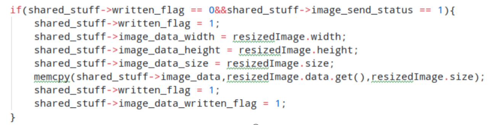

共享存储区设置如下：

 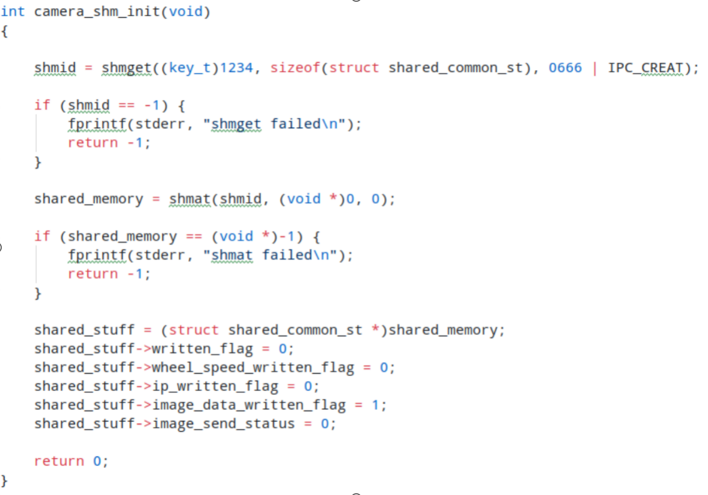

摄像头拍摄到的图像是YUV420SP颜色编码格式，帧数为5，分辨率为1280\*720。采用YUV420SP编码格式的图像大小为w\*h\*1.5（关于YUV420SP详见附录1），故若传输原始图像，需要的带宽为6.912MB/s，再加上各种传输延迟与网络状况的不稳定，可能导致各种意外情况，故小组决定传输预处理后的图像。预处理后的图像大小为224*224，极大的减小了带宽需求。

我们进一步对图像传输的代码进行了修改，去掉了无用的头部信息，减少传输带宽需求。图像传输的代码如下：

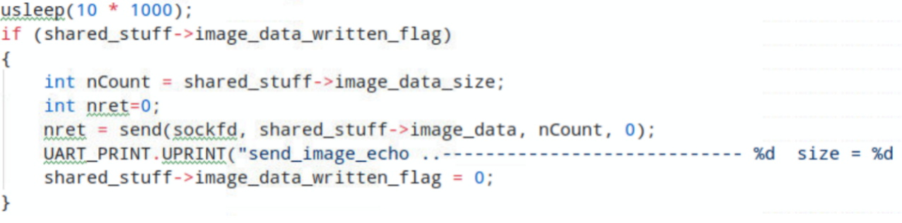

在接收远程命令方面，原代码已经足够完善，故并未做出更进一步修改。

修改后程序流程图如下：

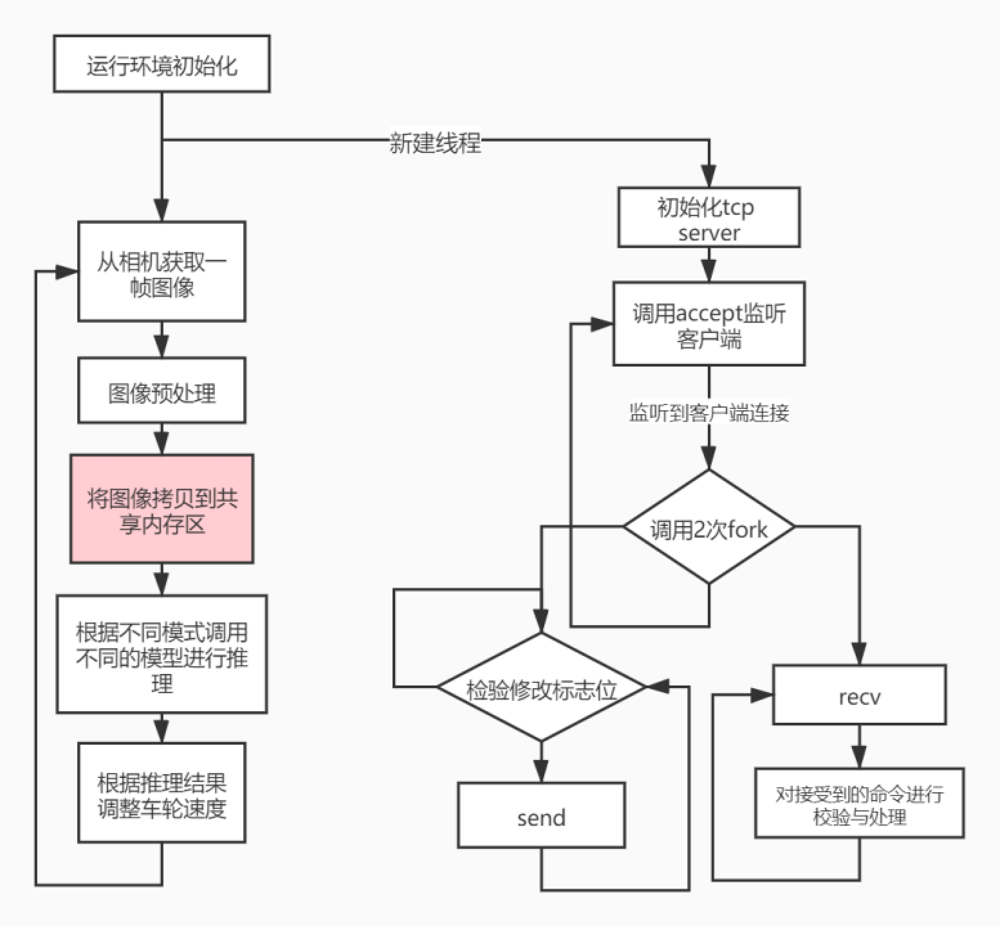

### 2.3 远程控制客户端

客户端采用QT开发，主要功能如下：

- 使用IP地址与智能小车进行tcp socket连接
- 对从智能小车接受到的YUV420SP格式的图像格式进行解码并显示
- 对智能小车发出切换模式的命令
- 在将智能小车切换到远程控制模式后，可以对其进行遥控 

客户端界面如下：

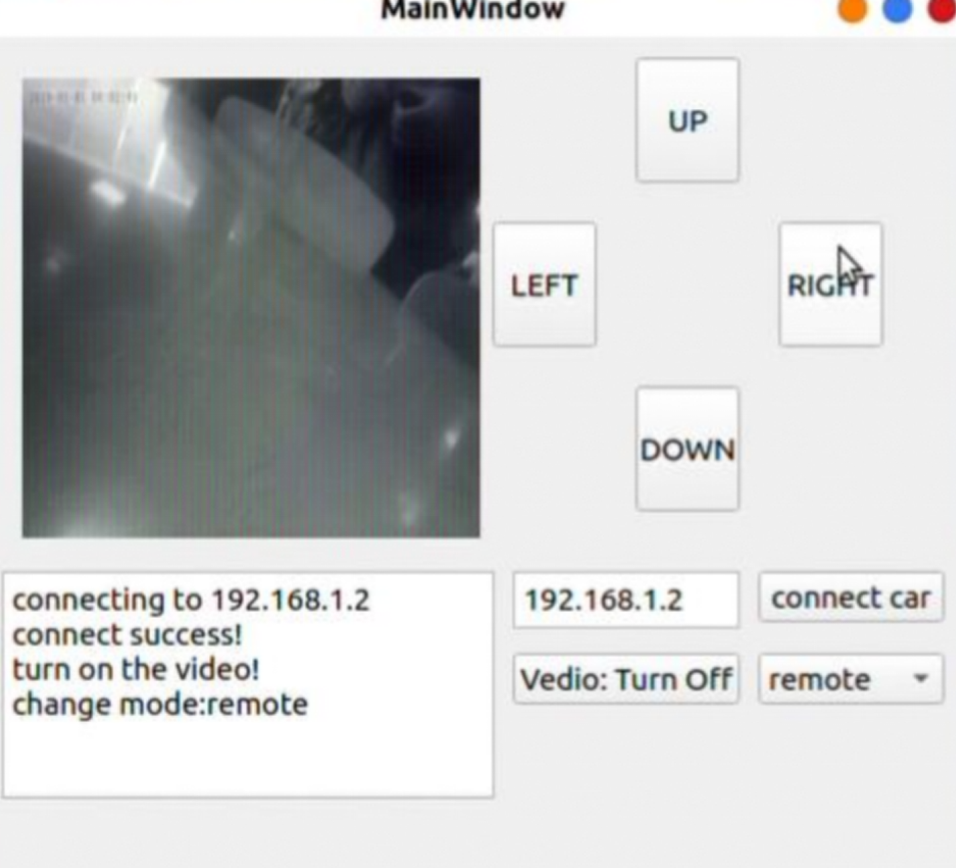

图像解码与显示的核心代码如下：

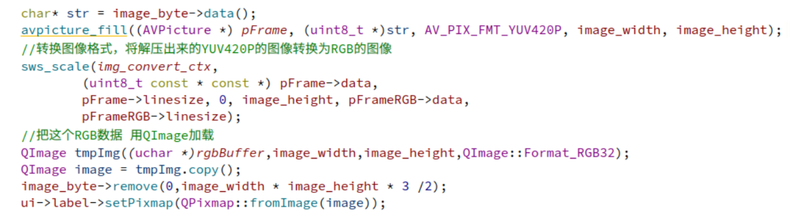

发送命令切换模式的代码如下：

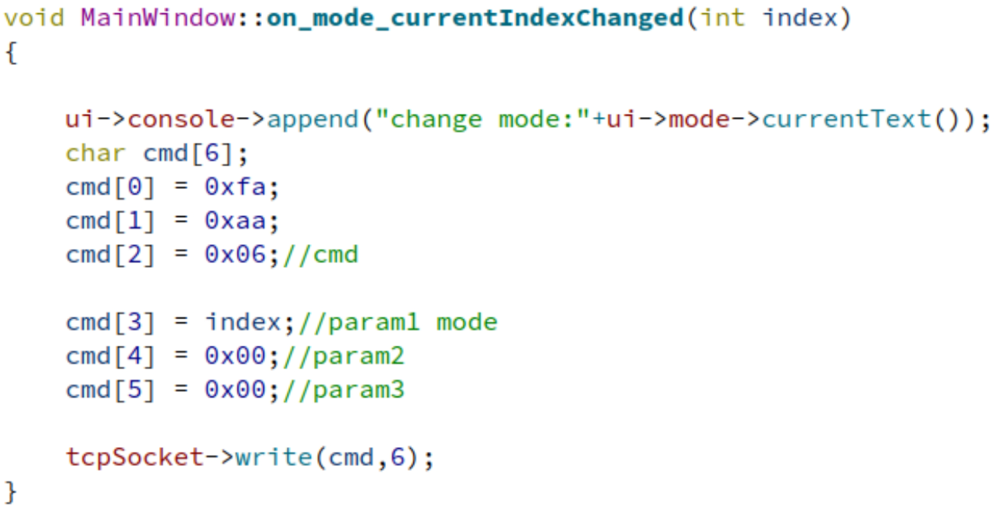

其中命令长度为6个字节，前两个字节固定，用于校验传输十分出错。第三个字节为命令码，后3个字节为参数。

 

远程控制的核心代码如下：

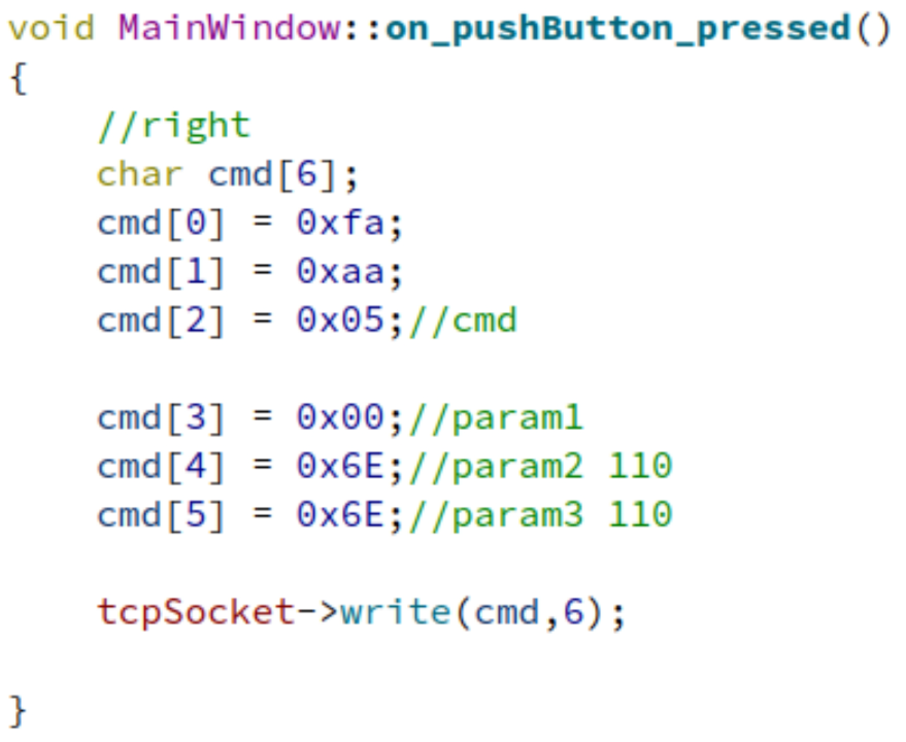

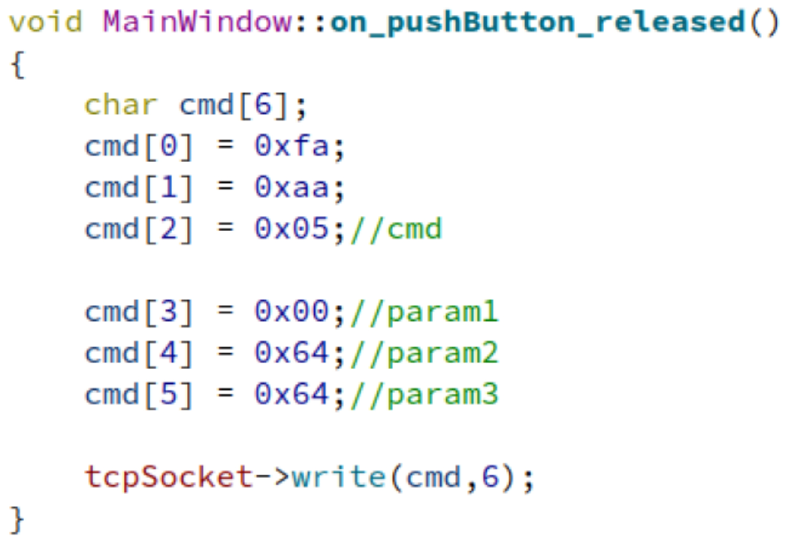

## 3 演示视频

**[远程操作控制](assets/demoVideo1.mp4)**

**[自动防跌落](assets/demoVideo2.mp4)**

## 附录一：YUV420SP格式详解

与我们熟知的RGB类似，YUV也是一种颜色编码方法，主要用于电视系统以及模拟视频领域，它将亮度信息（Y）与色彩信息（UV）分离，没有UV信息一样可以显示完整的图像，只不过是黑白的，这样的设计很好地解决了彩色电视机与黑白电视的兼容问题。并且，YUV不像RGB那样要求三个独立的视频信号同时传输，所以用YUV方式传送占用极少的频宽。

YUV，分为三个分量，“Y”表示明亮度（Luminance或Luma），也就是灰度值；而“U”和“V” 表示的则是色度（Chrominance或Chroma），作用是描述影像色彩及饱和度，用于指定像素的颜色。

YUV码流的存储格式其实与其采样的方式密切相关，主流的采样方式有三种，YUV444，YUV422，YUV420，后面的数字表示3个通道之间的采样比例，YUV 4:4:4采样，每一个Y对应一组UV分量，每个像素大小占用3byte。YUV 4:2:2采样，每两个Y共用一组UV分量，每个像素占用2byte。 YUV 4:2:0采样，每四个Y共用一组UV分量，每个像素占用1.5byte。

项目小车摄像头采用的是YUV420SP格式，SP指的是Y通道的信息与UV通道信息的存储顺序，如下图所示：

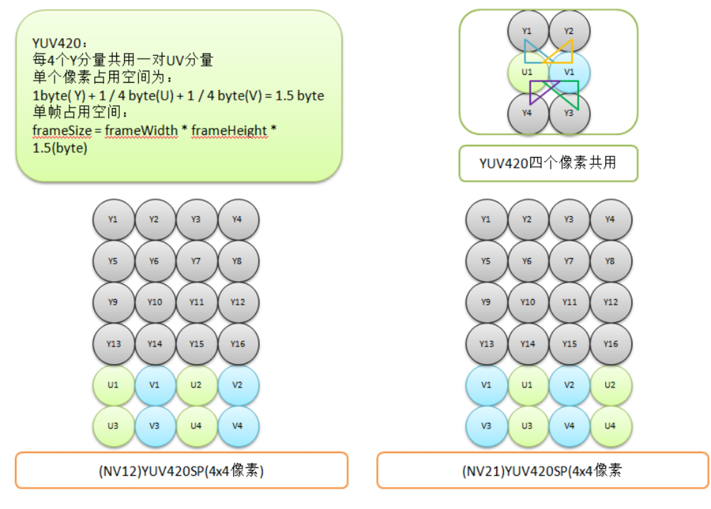